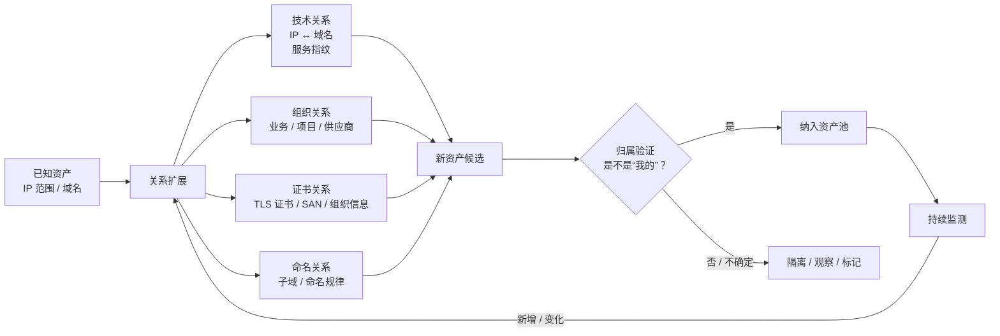
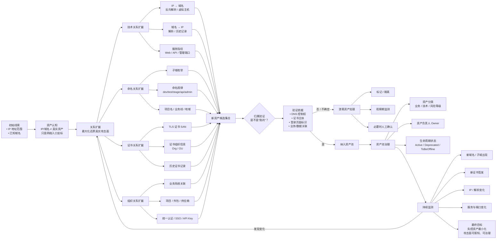
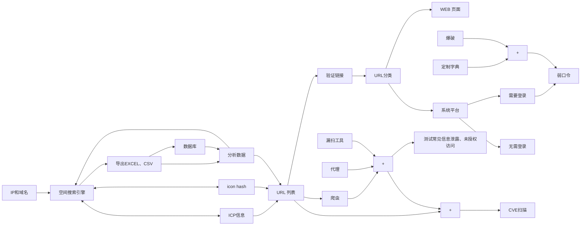

---
authors:
  - khora
date:
  created: 2023-12-31
  updated: 2024-01-02
categories:
  - 网络安全
tags:
  - 资产管理
draft: true
---

# 互联网资产管理 00

因为工作需要，日常需要处理大量的资产，开始的时候我也是一头雾水，后来慢慢总结了一些经验，在此和各位分享一下，也方便自己整理思路，同时如果您有更好的思路欢迎留言，如果为您提供了一点帮助，也不枉在此码字。

## 问题分析

### 我有什么

我手头上有一些 IP 地址范围、部分域名，仅此而已

### 我要做什么

筛选出相关资产，尽可能多的覆盖监测对象，减少游离的资产。

## 头脑风暴

### 一、当前掌握的本质是什么？

你现在只有两类东西：

* **IP 地址范围（IP Range）**
* **部分域名（Domain Seeds）**

从安全视角看，它们本质上是：

> 👉 **组织在网络空间中的“已知入口坐标”**

但问题是：

* 真实资产 ≠ 你已知的 IP / 域名
* 真实攻击面 ≫ 你看到的攻击面

所以目标可以重新表述为一句话：

> **以极少的初始线索，最大化还原组织在互联网中的真实存在形态**

---

### 二、总体思路（核心框架）

#### 一句话方法论

> **从「控制权线索」出发，不断做“关系扩展”，再用“归属验证”把资产收回来**

这其实是一个循环：

---

上面是 AI 生成的思路，不太好操作，下面是我的思路

!!! note annotate "Phasellus posuere in sem ut cursus (1)"

    这个事项的本质就是一次巨大的、循环的信息收集
    通过流程图不难看出，漏洞扫描和检测实则是其中简单的部分，因为当你面对那么多的资产，不要奢望发现所有的漏洞，这不现实！

先写到这里，之后的在[互联网资产管理 01](互联网资产管理-01.md)
